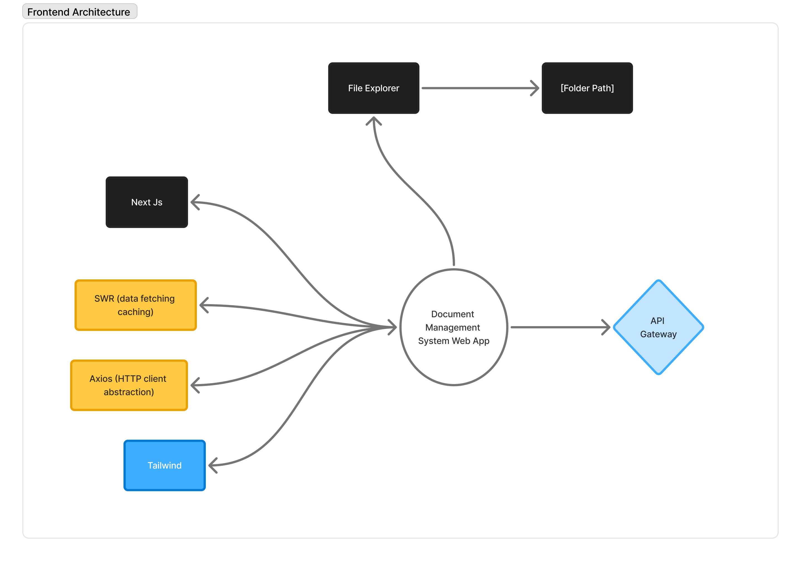
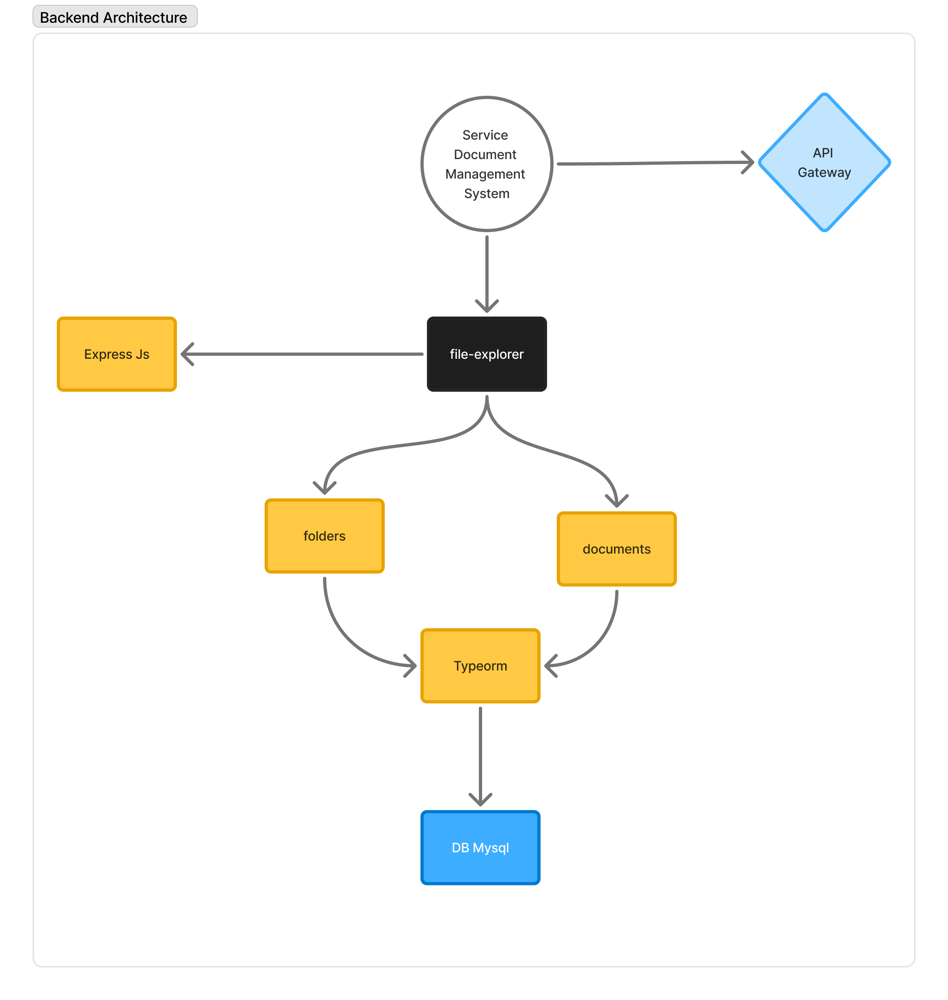
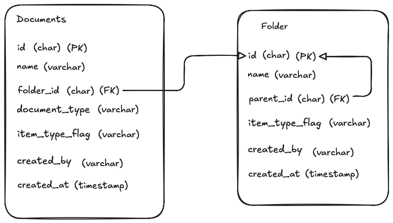

# Documents Management System

## Overview

This project is a simple **Documents Management System** that allows users to
create folders, create document metadata, and navigate nested folders.
The system supports **unlimited folder nesting** and **unified folder/document listing**.

> ⚠️ Note: Actual file upload is **not implemented**, as per the assignment requirements.
> Only document metadata is stored.

---

## Tech Stack

### Frontend

- Next.js (App Router)
- TypeScript
- SWR (data fetching & caching)
- Axios (HTTP client abstraction)
- Tailwind CSS

### Backend

- Node.js
- TypeScript
- Express.js
- TypeORM
- MySQL 8

---

## Features

- Unified file explorer for folders and documents
- Create folders and documents (metadata only)
- Unlimited nested folder structure
- Search folders and documents by name

---

## Architecture Overview

The application follows a **client–server architecture** with a clear separation
of concerns between presentation, business logic, and data persistence.

### Frontend

- Built with **Next.js (App Router)** and **TypeScript**
- Responsible for UI rendering, routing, and user interactions
- Uses **Tailwind CSS** for styling
- Uses **Axios** as a centralized HTTP client combined with **SWR**
  for caching and automatic revalidation
- Folder navigation is handled using **optional catch-all dynamic routes**
  (`app/[folderPath]`), enabling infinite nested folder navigation

  ## 

### Backend

- Built with **Node.js**, **TypeScript**, and **Express.js**
- Exposes RESTful APIs to manage folders and document metadata
- Provides a **unified explorer endpoint** that returns both folders
  and documents in a single ordered response

  ## 

### Database

- Uses **MySQL 8** as the relational database
- Folder hierarchy is modeled using a **self-referencing `parent_id` column**,
  allowing unlimited nesting
- Documents reference folders via a foreign key and can exist at the root level

This design keeps the frontend **stateless with respect to folder hierarchy**,
delegating traversal and hierarchy logic to the backend and database layers,
resulting in a scalable and maintainable system.

---

## Database Design

### folders

- `id` (UUID)
- `name`
- `parent_id` (nullable, self-referencing)
- `item_type_flag`
- `created_at`
- `created_by`

### documents

- `id` (UUID)
- `name`
- `folder_id` (nullable)
- `document_type`
- `created_by`
- `created_at`
- `item_type_flag`

## 

---

## API Endpoints

### Base URL

http://localhost:5001/api

---

### File Explorer

#### GET /file-explorer

Retrieve folders and documents under a specific parent folder.

**Query Parameters**

| Name     | Type           | Description                        |
| -------- | -------------- | ---------------------------------- |
| parentId | string \| null | Parent folder ID (`null` for root) |
| search   | string         | Optional search keyword            |

**Example Requests**

Get items in the root folder:

```json
/file-explorer
```

Get items inside a specific folder:

```json
/file-explorer?parentId=folder-123
```

Search items in the root folder:

```json
/file-explorer?search=invoice
```

Search items inside a specific folder:

```json
/file-explorer?parentId=folder-123&search=invoice
```

### Folder

#### POST /folders

Create a new folder.

**Request Body**

| Name      | Type           | Description                        |
| --------- | -------------- | ---------------------------------- |
| name      | string         | Folder name                        |
| parentId  | string \| null | Parent folder ID (`null` for root) |
| createdBy | string         | Creator name                       |

**Example Payload**

Create a folder in the root:

```json
{
  "name": "Invoices",
  "createdBy": "John Doe"
}
```

Create a folder inside another folder:

```json
{
  "name": "2024",
  "createdBy": "John Doe",
  "parentId": "folder-123"
}
```

### Document

#### POST /documents

Create a new document (metadata only).

**Request Body**

| Name         | Type           | Description                   |
| ------------ | -------------- | ----------------------------- |
| name         | string         | Document name                 |
| folderId     | string \| null | Folder ID (`null` for root)   |
| documentType | string         | Document type (e.g pdf, docx) |
| createdBy    | string         | Creator name                  |

**Example Payload**

Create a document in the root:

```json
{
  "name": "invoice-001.pdf",
  "documentType": "pdf",
  "createdBy": "John Doe"
}
```

Create a folder inside another document:

```json
{
  "name": "invoice-002.pdf",
  "documentType": "pdf",
  "createdBy": "John Doe",
  "folderId": "folder-123"
}
```

### Frontend Structure

```lua
src/
├── app/
│   └── [folderPath]/
│       └── page.tsx
├── components/
│   └── layout/
│   └── primitives/
│   └── ui/
├── constants/
├── features/
│   └── fileExplorer/
├── hooks/
├── lib/
├── services/
│   └── documents/
│   └── fileExplorer/
│   └── /
```

### Backend Structure

```lua
src/
├── config/
├── constants/
├── database/
│   └── migrations/
├── modules/
│   └── documents/
│   └── file-explorer/
│   └── folders/
├── utils/
```

### Prerequisites

Before running this project locally, ensure you have:

- Node.js (v18 or higher)
- MySQL 8.x (running locally)
- npm

### Setup & Run Locally

Close Repository :

```bash
git clone https://github.com/fiqrianwar/document-management.git
```

#### Backend Setup :

```bash
cd dms-services-express

npm install

cp .env.example .env
```

Configure .env :

```bash
PORT=5001
NODE_ENV=development
DB_HOST=localhost
DB_USER=your_local_db_user
DB_PASSWORD=your_local_db_password
DB_NAME=dms_db
DB_PORT=3306
```

Run Migrations :

```bash
npm run migration:run
```

Start Backend server :

```bash
npm run dev
```

Backend should be available at :

```bash
http://localhost:5001
```

Expected logs :

```bash
✅ Database connected
🚀 Server running on port 5001
```

#### Frontend Setup :

```bash
cd dms-client-next

npm install

cp .env.example .env
```

Configure .env :

```bash
NEXT_PUBLIC_API_URL=http://localhost:5001/api
```

Start frontend :

```bash
npm run dev
```

Frontend should be available at :

```bash
http://localhost:3000
```

Expected logs :

```bash
✓ Starting...
✓ Ready in ~800ms
```

### Environment Variables :

#### Backend

- PORT
- NODE_ENV
- DB_HOST
- DB_PORT
- DB_USER
- DB_PASSWORD
- DB_NAME

#### Frontend

- NEXT_PUBLIC_API_URL

### Key Design Decisions:

- Used self-referencing folders to support unlimited nesting
- Unified folder and document listing via a single explorer endpoint
- Delegated hierarchy traversal to backend for cleaner frontend logic
- Used SWR for efficient data fetching and revalidation
- Did not implement real file uploads per assignment requirements
